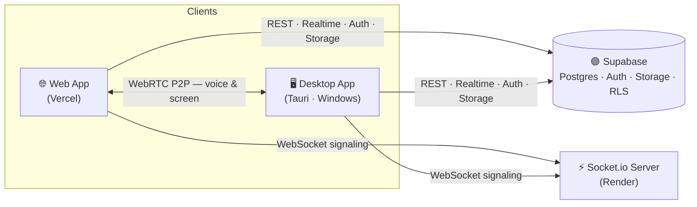

<div align="center">


# Staple

**Talk. Hang out. Share your screen. All in one place.**

A modern, real-time communication platform — servers, channels, voice, screen sharing, and direct messages — for the web and the desktop.

[](https://web.stapleapp.com/)
[](https://github.com/StapleApp/client/releases/latest/download/Staple-Setup.exe)

<br/>


[Features](#-features) · [Architecture](#-architecture) · [Getting Started](#-getting-started) · [Desktop App](#-desktop-app) · [Roadmap](#-roadmap) · [Team](#-team)

</div>

---

## 📖 Overview

**Staple** is a Discord-style communication app. Create **servers** with text and voice **channels**, hop into **low-latency voice chat**, **share your screen**, message friends directly, and manage everything from a clean, dark, keyboard-friendly interface.

It runs as a **web app** (Vercel) and as a **native Windows desktop app** (Tauri) that shares the exact same codebase.

> [!NOTE]
> Staple is split across three repositories: **[`client`](https://github.com/StapleApp/client)** (this repo — web + desktop UI), **`server`** (Socket.io signaling), and **`staple-website`** (marketing/landing site). Data, auth, and storage are powered by **Supabase**.

---

## ✨ Features

### 💬 Messaging
- Real-time text chat with **edit, delete, and reply**
- Live **typing indicators** and day separators
- Inline **GIF picker**, emoji, and image sharing
- Hover **profile cards** on any user

### 🔊 Voice & Screen
- **Low-latency voice chat** over WebRTC (mesh)
- **Voice activity detection** — see who's talking in real time
- **Per-user volume** control and a built-in **noise gate**
- **Screen sharing** with system audio

### 🧑‍🤝‍🧑 Social
- **Servers** with categories, text/voice channels, **roles & permissions**
- **Friends** via unique friendship codes — send, accept, reject, or cancel requests
- **Direct messages** with unread indicators
- A **persistent notification center** (read/unread + delete)
- **Presence & status**: online, idle, do-not-disturb, offline

### 🖥️ Platform
- **Web + Desktop** from one codebase (React + Tauri)
- **Persistent sessions** on desktop (survives app restarts)
- **Email & Google** authentication (Supabase Auth)

---

## 🏗 Architecture



| Layer | Technology |
| --- | --- |
| **Frontend** | React 19, Vite, Tailwind CSS 4, Framer Motion, React Router |
| **Database & Auth** | Supabase (Postgres, Auth, Storage, Row-Level Security) |
| **Realtime signaling** | Node.js + Socket.io (hosted on Render) |
| **Voice / Screen** | WebRTC mesh with client-side VAD, noise gate & per-user gain |
| **Desktop** | Tauri 2 (Rust shell, WebView2) with NSIS installer |
| **Hosting** | Vercel (web) · Render (signaling) · Supabase (backend) |

**How it fits together:** the client talks to **Supabase** for all persistent data, authentication, and file storage (protected by Row-Level Security). The **Socket.io** server never stores data — it only relays realtime events: WebRTC signaling (SDP/ICE), typing indicators, and voice-channel presence. Actual **voice and screen streams flow peer-to-peer** over WebRTC, keeping latency low and the server stateless.

---

## 📂 Project Structure

```text
client/
├─ src/
│  ├─ features/          # Route-level pages, grouped by domain
│  │  ├─ auth/           # Login, register, OAuth callback, password reset
│  │  ├─ home/           # Dashboard: servers, DMs, online friends, status
│  │  ├─ servers/        # Server pages, channels, roles, members
│  │  ├─ messaging/      # Direct messages
│  │  ├─ friends/        # Friend search & requests
│  │  ├─ profile/        # Profile & settings
│  │  └─ settings/
│  ├─ Components/
│  │  ├─ chat/           # ChatPanel, message content, GIF picker
│  │  ├─ voice/          # Voice bar & WebRTC UI
│  │  └─ layout/         # Navigator, notifications bell, route guards
│  ├─ context/           # AuthContext, VoiceContext
│  ├─ services/          # Supabase data layer (auth, user, friend, server, message …)
│  └─ config/            # Supabase client, socket, desktop auth storage
├─ src-tauri/            # Tauri (Rust) desktop shell + build config
└─ public/               # Static assets, icons, manifest
```

---

## 🚀 Getting Started

### Prerequisites
- **Node.js 20+**
- A **Supabase** project (apply the SQL schema to create tables & RLS policies)
- For the desktop app: **Rust** toolchain and the [Tauri prerequisites](https://tauri.app/start/prerequisites/)

### 1. Clone & install

```bash
git clone https://github.com/StapleApp/client
cd client
npm install
```

### 2. Configure environment

Create a `.env` file in the project root:

```bash
VITE_SUPABASE_URL=your-supabase-project-url
VITE_SUPABASE_ANON_KEY=your-supabase-anon-key
VITE_SITE_URL=https://web.stapleapp.com
VITE_KLIPY_API_KEY=your-klipy-gif-api-key
```

| Variable | Description |
| --- | --- |
| `VITE_SUPABASE_URL` | Your Supabase project URL |
| `VITE_SUPABASE_ANON_KEY` | Supabase public (anon) key — safe for the client, protected by RLS |
| `VITE_SITE_URL` | Public web origin, used for OAuth & email redirects |
| `VITE_KLIPY_API_KEY` | API key for the in-chat GIF picker |

### 3. Run

```bash
npm run dev          # Web app  → http://localhost:5173
npm run tauri:dev    # Desktop app (Tauri dev window)
```

> The realtime **signaling server** lives in the separate `server` repo and is deployed on Render; the client connects to it automatically via `VITE_SOCKET_URL` (defaults to the hosted instance).

---

## 🖥️ Desktop App

Staple ships a native **Windows** desktop build via **Tauri**. It reuses the web UI and uses the system WebView2 runtime, so the installer stays small (~4 MB).

### Download
Grab the latest installer — this link always points to the newest release:

**➡️ [Staple-Setup.exe](https://github.com/StapleApp/client/releases/latest/download/Staple-Setup.exe)**

### Build a release
Releases are automated with **GitHub Actions** ([`.github/workflows/release.yml`](.github/workflows/release.yml)). Pushing a `v*` **tag** builds the app in the cloud and publishes a GitHub Release with the installer attached — normal commits do **not** trigger a release.

```bash
# 1) Bump "version" in src-tauri/tauri.conf.json (e.g. 0.1.1 → 0.1.2), then:
git commit -am "Bump version to 0.1.2"
git push

# 2) Tag with the matching version and push the tag
git tag v0.1.2
git push origin v0.1.2
```

The Action builds (~10–15 min) and the new version appears under **Releases**.

> [!IMPORTANT]
> The tag (`v0.1.2`) and `version` in `tauri.conf.json` (`0.1.2`) must match, and every tag must be unique. CI requires the `VITE_*` values to be set as **repository secrets** (Settings → Secrets and variables → Actions).

To build locally instead:

```bash
npm run tauri:build   # → src-tauri/target/release/bundle/nsis/Staple_<version>_x64-setup.exe
```

---

## 🗺 Roadmap

- [ ] Group DMs
- [ ] End-to-end encryption for direct messages
- [ ] In-app auto-update
- [ ] Moderation: blocking, reporting & spam filtering

---

## 🤝 Contributing

Contributions, bug reports, and feature requests are welcome! Open an issue to start a discussion, or submit a pull request. Please run `npm run build` and `npm run lint` before opening a PR.

---

## 📄 License

Released under the **MIT License** — free to use, modify, and distribute.

---


## 📬 Contact

Questions, ideas, or collaboration? Reach out at **stapleapp@outlook.com**

<div align="center">
<br/>
<sub>Made with 📎 by the Staple team.</sub>
</div>
